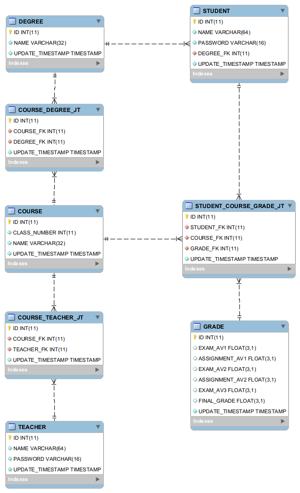
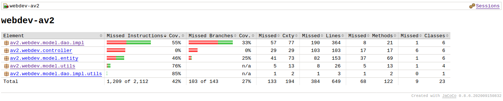
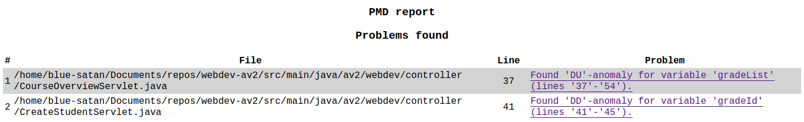

# Desenvolvimento de Aplicações Web - AV2

 

# Grupo

    Lucas Guimarães Cavalheiro - 2012200347
    Wallace Arruda de Macedo - 2013101787

# Nota ao professor

Olá professor! Estaremos fornecendo no comentário da área de entrega da av2:

- Um link para o deploy da aplicação na nuvem;
- As credenciais para a base de dados na nuvem;
- Link para o repositório no Github.

PS: As credenciais para a base de dados na nuvem já estarão inseridas no .zip do projeto enviado pelo AVA.

# Instruções

Para buildar o projeto, basta usar o wrapper do gradle de acordo com seu sistema operacional: gradlew.bat (Windows) ou ./gradlew (Unix). Para exemplificar os comandos a seguir, estaremos adotando o padrão Unix.

Para rodar o projeto em ambiente de desenvolvimento, basta rodar o comando `./gradlew`, que roda a task development, usada como padrão no projeto. 

Para rodar em produção, deve ser gerado o arquivo .war, usando o comando `./gradlew production`, este comando gera o arquivo .war no path build/libs/, este arquivo .war pode ser rodado normalmente em um servidor tomcat.

Logins válidos da aplicação podem ser encontrados no arquivo de dump da base de dados (sqlDump-19-11-2020.sql) nas tabelas STUDENT para alunos e TEACHER apra professores.

## Logins de exemplo

    Aluno : Login 2020010001 | Senha ZCG517
    Professor : Login 99990001 | Senha RPY125

# ATENÇÃO!

O projeto depende de uma base de dados MySQL, uma está disponível na nuvem pronta para uso, as credenciais para a mesma estarão disponíveis em uma anotação a parte (nota ao professor). Caso queira rodar o banco de dados MySQL localmente, temos um arquivo de dump da base de dados original (sqlDump-19-11-2020.sql), que poderá ser carregada localmente com ferramentas como MySQL Workbench ou phpMyAdmin, após carregar a base de dados local, basta fazer o projeto apontar para o banco em localhost, definindo as credenciais adequadas no arquivo `src/main/java/av2/webdev/model/utils/DatabaseCredentialsGetter.java`, método getDatabaseCredentials, linhas 11-14.

## Modelo Entidade Relacionamento:

## Code Coverage:

## PMD report:
